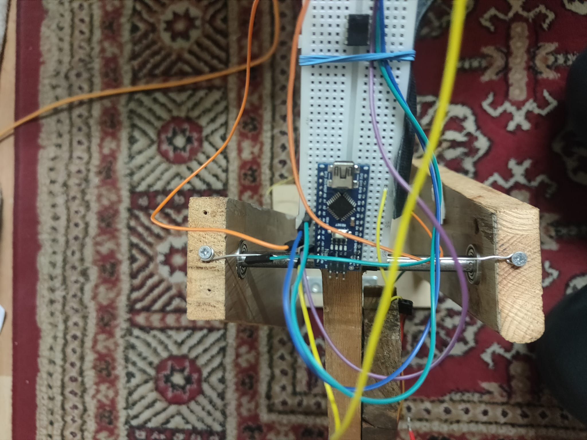
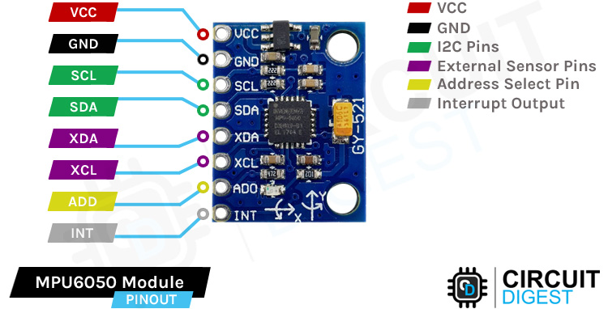

<h2> What? </h2>

I thought of a fun (and safe) way to utilise and demonstrate PID controllers in action, and this is what came across. It moves like a see-saw but the force is only on one side. This is harder to work with than a system with two motors opposite to each other, as we are relying on gravity to pull down the stick when we want it to descend.

The physical system consists of a stand connected to the shaft of a wooden stick via ball-bearings, providing low friction and free movement. As for the technical side we have a microcontroller used to control the speed of the brushless motor using a PWM signal(Pulse Width Modulation) based on the readings of an angle sensor. I have used the MPU6050 (cheap and reliable!).

<div class="text-center p-4">
  
  
  
</div>

<h2>How?</h2>

There three parts to the control algorithm:
<ul>
  <li> Read sensor data</li>
  <li> Convert readings into angle using calculations</li>
  <li> Filter sensor data</li>
  <li> Compare current reading with the desired angle</li>
  <li> Calculate the PID output</li>
  <li> Translate PID output into a duty cycle reading.</li>
</ul>

This is pretty much what makes up the control system, but if you'd like to look into the technicality of the process then have a look at the code below:

```cpp
#include <Servo.h> // using servo.h library for convenience

/* Brushless motors (as indicated by their name) don't need brushes to power them on, but rather they relay on induction to move the shaft. 
   Operating them is not as simple as connecting a power supply.
   Rather, we need an intermediate chip to control the speed of the motor using a PWM signal from a controller. 
   In this case, we use an ESC (electronic speed controller)
*/

#define MAX_SIGNAL 2000 
#define MIN_SIGNAL 1000 // these values are used to calibrate the ESC
#define MOTOR_PIN 10

#include <Wire.h>
#include "filter_lib.h"
// The motor creates a lot of vibration which makes angle readings VERY noisy. Using a Kalman Filter has proven to be insufficient

// create filter with 20 Hz cut-off frequency
lowpass_filter lowpassFilter(3); // create filter class

const int MPU = 0x68; // MPU6050 I2C address
float AccX, AccY, AccZ;
float AccXerr, AccYerr;
float GyroX, GyroY, GyroZ;
float accAngleX, accAngleY, gyroAngleX, gyroAngleY, gyroAngleZ;
float roll, pitch, yaw;
float AngleAccErrorX, AngleAccErrorY, GyroErrorX, GyroErrorY, GyroErrorZ;
float elapsedTime, currentTime, previousTime;

float KalmanAngleRoll = 0, KalmanUncertaintyAngleRoll = 2*0.001;
float KalmanAnglePitch = 0, KalmanUncertaintyAnglePitch = 2*0.001;
float Kalman1DOutput[] = {0, 0}; //{angle prediction, uncertainty of prediction}

float Desired_angle = 0;
float Angle_error = 0; // current angle error
float previous_error; // 

int Throttle = 1350; // This is the base throttle value. I found this to be the sweet spot as a start
float pid_p = 0, pid_i = 0, pid_d = 0, PID = 0; //<-|----PID constants
float kp = 2, ki = 0, kd = 1.5; //<-----------------|

int DELAY = 1000;
int n = 0;

Servo motor;

void setup() {
  Serial.begin(9600);
  //MPU6050 setup
  Wire.begin();                      // Initialize comunication
  Wire.beginTransmission(MPU);       // Start communication with MPU6050 // MPU=0x68
  Wire.write(0x6B);                  // Talk to the register 6B
  Wire.write(0x00);                  // Make reset - place a 0 into the 6B register
  Wire.endTransmission(true);        //end the transmission

  //motor setup
  motor.attach(MOTOR_PIN); //

  Serial.print("Now writing maximum output: (");Serial.print(MAX_SIGNAL);Serial.print(" us in this case)");Serial.print("\n");
  Serial.println("Turn on power source, then wait 2 seconds and press any key.");
  motor.writeMicroseconds(MAX_SIGNAL);

  // Wait for input
  while (!Serial.available());
  Serial.read();

  // Send min output
  Serial.println("\n");
  Serial.println("\n");
  Serial.print("Sending minimum output: (");Serial.print(MIN_SIGNAL);Serial.print(" us in this case)");Serial.print("\n");
  motor.writeMicroseconds(MIN_SIGNAL);
  delay(10000); // give time for esc to calibrate
  motor.writeMicroseconds(1100);
  Serial.println("The ESC is calibrated");

  delay(3000);

}

void loop() {
  //read sensor values
  Wire.beginTransmission(MPU);
  Wire.write(0x3B); // Start with register 0x3B (ACCEL_XOUT_H)
  Wire.endTransmission(false);
  Wire.requestFrom(MPU, 6, true); // Read 6 registers total, each axis value is stored in 2 registers
  //For a range of +-2g, we need to divide the raw values by 16384, according to the datasheet
  AccX = (Wire.read() << 8 | Wire.read()) / 16384.0 - 1839/16384; // X-axis value
  AccY = (Wire.read() << 8 | Wire.read()) / 16384.0 + 4198/16384; // Y-axis value
  AccZ = (Wire.read() << 8 | Wire.read()) / 16384.0 - 1664/16384; // Z-axis value
  // Calculating Roll and Pitch from the accelerometer data
  accAngleX = (atan(AccY / sqrt(pow(AccX, 2) + pow(AccZ, 2))) * 180 / PI); // AccErrorX ~(0.58) See the calculate_IMU_error()custom function for more details
  accAngleY = (atan(-1 * AccX / sqrt(pow(AccY, 2) + pow(AccZ, 2))) * 180 / PI); // AccErrorY ~(-1.58)
  // === Read gyroscope data === //

  previousTime = currentTime;        // Previous time is stored before the actual time read
  currentTime = millis();            // Current time actual time read
  elapsedTime = (currentTime - previousTime) / 1000; // Divide by 1000 to get seconds
  // commented out gyro reading as they aren't needed
  /*
  Wire.beginTransmission(MPU);
  Wire.write(0x43); // Gyro data first register address 0x43
  Wire.endTransmission(false);
  Wire.requestFrom(MPU, 6, true); // Read 4 registers total, each axis value is stored in 2 registers
  GyroX = (Wire.read() << 8 | Wire.read()) / 131.0; // For a 250deg/s range we have to divide first the raw value by 131.0, according to the datasheet
  GyroY = (Wire.read() << 8 | Wire.read()) / 131.0;
  GyroZ = (Wire.read() << 8 | Wire.read()) / 131.0;
  // Correct the outputs with the calculated error values
  GyroX = GyroX - 76/131; // GyroErrorX ~(-0.56)
  GyroY = GyroY - 67/131; // GyroErrorY ~(2)
  GyroZ = GyroZ - 75/131; // GyroErrorZ ~ (-0.8)
  // Currently the raw values are in degrees per seconds, deg/s, so we need to multiply by sendonds (s) to get the angle in degrees
 
  gyroAngleX = gyroAngleX + GyroX * elapsedTime; // deg/s * s = deg
  gyroAngleY = gyroAngleY + GyroY * elapsedTime;
  yaw =  yaw + GyroZ * elapsedTime;
  // Complementary filter - combine acceleromter and gyro angle values
  roll = 0.10 * gyroAngleX + 0.90 * accAngleX;
  pitch = 0.96 * gyroAngleY + 0.04 * accAngleY;
  */
  float prev_angle = KalmanAngleRoll;
  
  kalman_1d(KalmanAngleRoll,KalmanUncertaintyAngleRoll,AccX,accAngleX);
  
  float diff = (Kalman1DOutput[0] - prev_angle)/elapsedTime;
  
  KalmanAngleRoll = Kalman1DOutput[0];
  KalmanUncertaintyAngleRoll = Kalman1DOutput[1];
  KalmanAngleRoll = lowpassFilter.filter(KalmanAngleRoll);
  // don't need pitch reading
  /*
  kalman_1d(KalmanAnglePitch,KalmanUncertaintyAnglePitch,AccY,accAngleY);
  KalmanAnglePitch = Kalman1DOutput[0];
  KalmanUncertaintyAngleRoll = Kalman1DOutput[1];
  */
  // calculate error
  Angle_error = Desired_angle + KalmanAngleRoll;
  // PID calculations
  
  pid_p = kp*Angle_error;
  
  if(-3 < Angle_error < 3 ){
    pid_i = pid_i + ki*Angle_error;
  }
  
  pid_d = kd*(Angle_error - previous_error)/elapsedTime;

  PID = pid_p + pid_i + pid_d;
  //PID = PID_LP.filter(PID);
  PID = constrain(PID,-350, 400); // constraining PID value for safety
  /*
  if (Serial.available() > 0)
  {
    int DELAY = Serial.parseInt();
    if (DELAY > 999)
    {
      
      motor.writeMicroseconds(DELAY);
      float SPEED = (DELAY-1000)/10;
      Serial.print("\n");
      Serial.println("Motor speed:"); Serial.print("  "); Serial.print(SPEED); Serial.println("%"); 
      Serial.println("angle: "); Serial.print(KalmanAngleRoll);
    }     
  }
  */
  previous_error = Angle_error;
  
  DELAY = Throttle + PID;
  DELAY = constrain(DELAY,1000,1700); // Safety measures
  
  if(-40 < KalmanAngleRoll < 30){
    motor.writeMicroseconds(DELAY); // Safety measures
  }
 
  // Serial.println("angle : "); 
  //Serial.println(KalmanAngleRoll);
  if (n = 5000){
    Serial.print("angle:");
    Serial.println(KalmanAngleRoll);
    //Serial.print("PID:"); 
    //Serial.println(PID);
    Serial.print("DELAY:");
    Serial.println(DELAY);
    n = 0;
  }
  n++;
}
 

void kalman_1d(float KalmanState, float KalmanUncertainty, float KalmanInput, float KalmanMeasurement){
  KalmanState = KalmanState + 0.004*KalmanInput;
  KalmanUncertainty = KalmanUncertainty + 0.4*0.4*20*20;
  float KalmanGain = KalmanUncertainty * 1/(1*KalmanUncertainty + 3*3);
  KalmanState = KalmanState + KalmanGain * (KalmanMeasurement - KalmanState);
  KalmanUncertainty = (1-KalmanGain) * KalmanUncertainty;
  Kalman1DOutput[0] = KalmanState;
  Kalman1DOutput[1] = KalmanUncertainty;
}
// This function uses the Kalman filter equations to improve readings
```

<h2>Results</h2>
Overall, the control algorithm seems to be effective. 

Without the low-pass filter, the system experiences significant oscillation due to noisy sensor readings. The low-pass filter solves this problem, however it comes with slightly delayed sensor readings.

There is a satisfactory amount of distrubance rejection, with a settling time of about 5 seconds.

Below is the demonstration of the system in action:

<iframe width="560" height="315" src="https://www.youtube.com/embed/uXsSm-ZEUNU?si=KSJ9VYgaaeFNC-vx" title="YouTube video player" frameborder="0" allow="accelerometer; autoplay; clipboard-write; encrypted-media; gyroscope; picture-in-picture; web-share" allowfullscreen></iframe>

