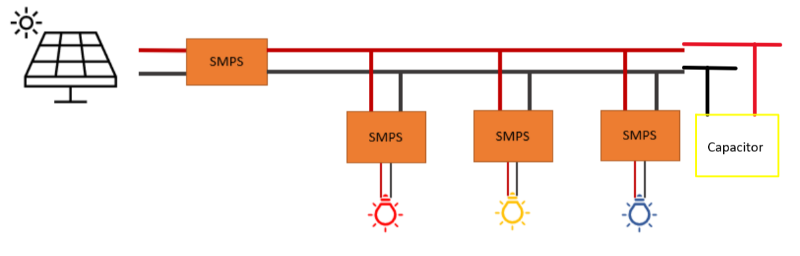

<h2> What? </h2>
Powering a grid using the sun is not as straightforward as it initially seems. This is because the voltage that a solar panel outputs is proportional to sunlight intensity, which is rarely stable (especially in the UK!). Consequently, we need a way of drawing varying amounts of power based on how much is available from a panel. 

One solution is using an SMPS (Switch-Mode Power Supplies), which can draw different voltages (hence currents) based on the duty cycle of a PWM signal. The duty cycle is proportion that a signal with period T seconds is on (or HIGH), and varies between 0 and 100 percent.

This also gives us the ability to either "buck" or "boost" the input voltage from the solar panels. "Buck" is a term for reducing input voltage, and "boost" means increasing the voltage. We have decided to go with the boost configuration as this allows us to charge the capacitor to a higher voltage.

The diagram below outlines the circuit's layout:



<h2> Equipment </h2>
<ul>
  <li>5 volts, 230mA solar panel (x3)</li>
  <li>Buck/Boost SMPS device</li>
  <li>18V, 0.25F Capacitor</li>
  <li>Buck SMPS with adafruit microcontroller (x3)</li>
  <li>Red LED</li>
  <li>Blue LED</li>
  <li>Yellow LED</li>
  <li>Sun?</li>
</ul>

<h2> How? </h2>
In the boost SMPS, we have implemented a type of MPPT algorithm named "perturb and observe". This is explained in the code below. 
In the Buck SMPS, we implemented a PID algorithm that limits the current at the LEDs' current ratings, to ensure that none of them break.
The capacitor is directly connected to the grid, which means that the voltage of the grid will never change abruptly due to changing sunlight conditions. 

```cpp
/*
 * Boost SMPS code
 * pin6 is PWM output at 62.5kHz.
 * duty-cycle saturation is set as 2% - 98%
*/

#include <Wire.h>
#include <INA219_WE.h>

INA219_WE ina219; // this is the instantiation of the library for the current sensor

float open_loop = 0.5, closed_loop; // Duty Cycles
float va,vb,vref,iL,dutyref,current_mA; // Measurement Variables
float prev_vb,prev_iL;
float del_pwr = 0,del_vb = 0,del_iL = 0;
float vb_limit;
float variable_p;
unsigned int sensorValue0,sensorValue1,sensorValue2,sensorValue3;  // ADC sample values declaration
float curr_pwr,prev_pwr;
float ev=0,cv=0,ei=0,oc=0; //internal signals
float Ts=0.001; //1 kHz control frequency. It's better to design the control period as integral multiple of switching period.
float kpv=0.05024,kiv=15.78,kdv=0; // voltage pid.
float u0v,u1v,delta_uv,e0v,e1v,e2v; // u->output; e->error; 0->this time; 1->last time; 2->last last time
float kpi=0.02512,kii=39.4,kdi=0; // float kpi=0.02512,kii=39.4,kdi=0; // current pid.
float u0i,u1i,delta_ui,e0i,e1i,e2i; // Internal values for the current controller
float uv_max=4, uv_min=0; //anti-windup limitation
float ui_max=50, ui_min=0; //anti-windup limitation
float current_limit = 1.0;
boolean Boost_mode = 0;
boolean CL_mode = 0;
unsigned int loopTrigger;
unsigned int com_count=0;   // a variables to count the interrupts. Used for program debugging.
float dutyCycleIncrement = 0.01;    // Duty cycle adjustment step size
int count = 0;
float pwr_threshold = 0.01;
float vb_threshold = 0.01;

void setup() {

  //Basic pin setups
  
  noInterrupts(); //disable all interrupts
  pinMode(13, OUTPUT);  //Pin13 is used to time the loops of the controller
  pinMode(3, INPUT_PULLUP); //Pin3 is the input from the Buck/Boost switch
  pinMode(2, INPUT_PULLUP); // Pin 2 is the input from the CL/OL switch
  analogReference(EXTERNAL); // We are using an external analogue reference for the ADC

  // TimerA0 initialization for control-loop interrupt.
  
  TCA0.SINGLE.PER = 999; //
  TCA0.SINGLE.CMP1 = 999; //
  TCA0.SINGLE.CTRLA = TCA_SINGLE_CLKSEL_DIV16_gc | TCA_SINGLE_ENABLE_bm; //16 prescaler, 1M.
  TCA0.SINGLE.INTCTRL = TCA_SINGLE_CMP1_bm; 

  // TimerB0 initialization for PWM output
  
  pinMode(6, OUTPUT);
  TCB0.CTRLA=TCB_CLKSEL_CLKDIV1_gc | TCB_ENABLE_bm; //62.5kHz
  analogWrite(6,120); 

  Serial.begin(115200);   //serial communication enable. Used for program debugging.
  interrupts();  //enable interrupts.
  Wire.begin(); // We need this for the i2c comms for the current sensor
  ina219.init(); // this initiates the current sensor
  Wire.setClock(700000); // set the comms speed for i2c
  
}

 void loop() {
  if(loopTrigger) { // This loop is triggered, it wont run unless there is an interrupt
    
    digitalWrite(13, HIGH);   // set pin 13. Pin13 shows the time consumed by each control cycle. It's used for debugging.
    
    // Sample all of the measurements and check which control mode we are in
    sampling();
    CL_mode = digitalRead(3); // input from the OL_CL switch
    Boost_mode = digitalRead(2); // input from the Buck_Boost switch

    if (Boost_mode){
      if (CL_mode) { //Closed Loop Boost
          pwm_modulate(1); // This disables the Boost as we are not using this mode
      }else{ // Open Loop Boost
          current_limit = 2; // 
          oc = iL-current_limit; // Calculate the difference between current measurement and current limit
          if ( oc > 0) {
            open_loop=open_loop+0.001; // We are above the current limit so less duty cycle
          } else {
            open_loop=open_loop-0.001; // We are below the current limit so more duty cycle
          }
          
          vb_limit = 17;
          if((vb-vb_limit) > 0){
            open_loop += 0.1; 
            }
            
          open_loop=saturation(1-open_loop,0.99,0.29); // saturate the duty cycle at the reference or a min of 0.01
          pwm_modulate(open_loop); // and send it out
          curr_pwr = iL*vb; //calculated power in this instance
          del_pwr = curr_pwr - prev_pwr; //calculate power difference
          del_vb = vb - prev_vb; // calculate voltage difference
          if(del_pwr != 0){ 
            if(del_pwr > 0){ 
              if(del_vb < 0){
                open_loop -= 0.01; 
                }
              else{
                open_loop += 0.01; 
                }
              }
            else{
              if(del_vb < 0){ 
                open_loop += 0.01; 
                }
              else{
                open_loop -= 0.01;
                }
              }
          }
          else{
            //do nothing
            }
      open_loop=saturation(1 - open_loop,0.99,0.29); // saturate the duty cycle between 0.99 and 0.29
      pwm_modulate(open_loop); // and send it out
      variable_p = prev_pwr; // for debugging
      prev_pwr = curr_pwr;
      prev_vb = vb;
      }
    }else{      
      if (CL_mode) { // Closed Loop Buck
          pwm_modulate(1); // This disables the Buck as we are not using this mode
      }else{ // Open Loop Buck
          pwm_modulate(1); // This disables the Buck as we are not using this mode
      }
    }

    com_count++;              //used for debugging.
    if (com_count >= 10) {  //send out data every second.
      Serial.print("Va: ");
      Serial.print(va);
      Serial.print("\t");

      Serial.print("Vb: ");
      Serial.print(vb);
      Serial.print("\t");

      Serial.print("Inductor Current: ");
      Serial.print(iL);
      Serial.print("\t\t");

      Serial.print("Boost Mode: ");
      Serial.print(Boost_mode);
      Serial.print("\t\t");

      Serial.print("CL Mode: ");
      Serial.print(CL_mode);
      Serial.print("\t\t");

      Serial.print("Duty(inverted): ");
      Serial.print(1-open_loop);
      Serial.print("\t\t");

      Serial.print("Curr_pwr: ");
      Serial.print(curr_pwr);
      Serial.print("\t\t");

      Serial.print("Iout: ");
      Serial.print(curr_pwr/va);
      Serial.print("\t\t");
      
      Serial.print("prev_pwr: ");
      Serial.print(variable_p);
      Serial.print("\n");
      com_count = 0;   
    }
    prev_pwr = curr_pwr;
    digitalWrite(13, LOW);   // reset pin13.
    loopTrigger = 0;
  }
  count += 1;
}


// Timer A CMP1 interrupt. Every 800us the program enters this interrupt. 
// This, clears the incoming interrupt flag and triggers the main loop.

ISR(TCA0_CMP1_vect){
  TCA0.SINGLE.INTFLAGS |= TCA_SINGLE_CMP1_bm; //clear interrupt flag
  loopTrigger = 1;
}

// This subroutine processes all of the analogue samples, creating the required values for the main loop

void sampling(){

  // Make the initial sampling operations for the circuit measurements
  
  sensorValue0 = analogRead(A0); //sample Vb
  sensorValue2 = analogRead(A2); //sample Vref
  sensorValue3 = analogRead(A3); //sample Va
  current_mA = ina219.getCurrent_mA(); // sample the inductor current (via the sensor chip)

  // Process the values so they are a bit more usable/readable
  // The analogRead process gives a value between 0 and 1023 
  // representing a voltage between 0 and the analogue reference which is 4.096V
  
  vb = sensorValue0 * (12400/2400) * (4.096 / 1023.0); // Convert the Vb sensor reading to volts
  vref = sensorValue2 * (4.096 / 1023.0); // Convert the Vref sensor reading to volts
  va = sensorValue3 * (12400/2400) * (4.096 / 1023.0); // Convert the Va sensor reading to volts

  // The inductor current is in mA from the sensor so we need to convert to amps.
  // We want to treat it as an input current in the Boost, so its also inverted
  // For open loop control the duty cycle reference is calculated from the sensor
  // differently from the Vref, this time scaled between zero and 1.
  // The boost duty cycle needs to be saturated with a 0.33 minimum to prevent high output voltages
  
  if (Boost_mode == 1){
    iL = -current_mA/1000.0;
    dutyref = saturation(sensorValue2 * (1.0 / 1023.0),0.99,0.33);
  }else{
    iL = current_mA/1000.0;
    dutyref = sensorValue2 * (1.0 / 1023.0);
  }   
}

float saturation( float sat_input, float uplim, float lowlim){ // Saturatio function
  if (sat_input > uplim) sat_input=uplim;
  else if (sat_input < lowlim ) sat_input=lowlim;
  else;
  return sat_input;
}


void pwm_modulate(float pwm_input){ // PWM function
  analogWrite(6,(int)(255-pwm_input*255)); 
}


/*end of the program.*/
```

Below is the BUCK smps code for the LED's:

```python
# Developed by Aymen Jaber Shakhwat 
from machine import Pin, ADC, PWM

vret_pin = ADC(Pin(26))
vout_pin = ADC(Pin(28))
vin_pin = ADC(Pin(27))
pwm = PWM(Pin(0))
pwm.freq(100000)
pwm_en = Pin(1, Pin.OUT)

count = 0
pwm_out = 0
pwm_ref = 1000
setpoint = 0.0
delta = 100
I_min = 0.075 # this is different for various LED colours
I_max = 0.3 # so does this one

# Define the reference voltage of the ADC (adjust as per your system)
ADC_REFERENCE_VOLTAGE = 3.3

def adc_to_voltage(adc_value): 
    return (adc_value / 65535) * ADC_REFERENCE_VOLTAGE # convert digital reading to voltage

def voltage_to_adc(voltage_value):
    return (voltage_value * 65535) / ADC_REFERENCE_VOLTAGE # convert voltage reading to digital


def saturate(duty): #limit duty cycle to protect LED drivers
    if duty > 62500:
        duty = 62500
    if duty < 100:
        duty = 100
    return duty


def current_limiter(vret, pwm_ref,I_max): # Used to limit current based on I_max
    if vret >= I_max:
        pwm_ref = pwm_ref + delta
    elif vret <= I_min:
        pwm_ref = pwm_ref - delta
    else:
        pwm_ref = pwm_ref
    #return pwm_ref

#PID control variables
# This also varies between LED colours
kpi = 0.5 
kdi = 0
kii = 0.1

def pidi(pid_input)
    e_integration = 0 #initalises e_integration value
    global e1i,e2i #creates global variable that store the previous values 
    e0i = 0.07 - vret
    e_integration = e0i
    u1i = vret
    e2i = e1i
    e1i = pid_input
    
    #anti-windup
    if u1i >= I_max
        e_integration = 0
    elif u1i <= I_min
        e_integration = 0

    delta_ui = kpi * (e0i - e1i) + kii * Ts * e_integration + kdi / Ts * (e0i - 2 * e1i + e2i)
    u0i = u1i + delta_ui
    return u0i 
        
while True:
    pwm_en.value(1)

    vin_bin = vin_pin.read_u16()
    vout_bin = vout_pin.read_u16()
    vret_bin = vret_pin.read_u16()
 
    vin = adc_to_voltage(vin_pin.read_u16())   #This reads the pins in volts rather than binary
    vout = adc_to_voltage(vout_pin.read_u16())
    vret = adc_to_voltage(vret_pin.read_u16())
    count = count + 1
    maxpower = vret * vret
    #I_max = maxpower / vout

    pwm_ref = 25000
    pwm_out = saturate(pwm_ref)
    pwm.duty_u16(pwm_out)
    current_limiter(vret, pwm_out/62500,I_max)
    pwm_out = int(pidi(vret) * 62500)
    
     
for 
    

    if count > 2000:
        print("Vin = {:.0f}".format(vin))
        print("Vout = {:.0f}".format(vout))
        print("Vret = {:.0f}".format(vret))
        print("Duty = {:.0f}".format(pwm_out))
        print("Bin Vin = {:.0f}".format(vin_bin))
        print("Bin Vout = {:.0f}".format(vout_bin))
        print("Bin Vret = {:.0f}".format(vret_bin))
    
        

        
        count = 0
```

<h2> Results </h2>
To test the sytem out, I simulated the solar panels using a variable power supply. This is more reliable than using the sun as we can directly control voltage levels.

When the voltage increases, I saw that the boost SMPS was drawing more power. Likewise, when voltage decreases the SMPS draws less power. 
At the same time, the LED's worked well when connected to the grid, proving the system to be reliable. 

After multiple tests, we saw that the LED's lasted for a maximum of 20 seconds when voltage is zero.

Below is a video showcasing the system:

<iframe width="560" height="315" src="https://www.youtube.com/embed/L2T6Ma9WZpw?si=nWW-nAM6TElNg7fB" title="YouTube video player" frameborder="0" allow="accelerometer; autoplay; clipboard-write; encrypted-media; gyroscope; picture-in-picture; web-share" allowfullscreen></iframe>

And outside with the real panels:

<iframe width="560" height="315" src="https://www.youtube.com/embed/GuKI7Nkt1Wo?si=3TTA17BVIXxN1iQy" title="YouTube video player" frameborder="0" allow="accelerometer; autoplay; clipboard-write; encrypted-media; gyroscope; picture-in-picture; web-share" allowfullscreen></iframe>

